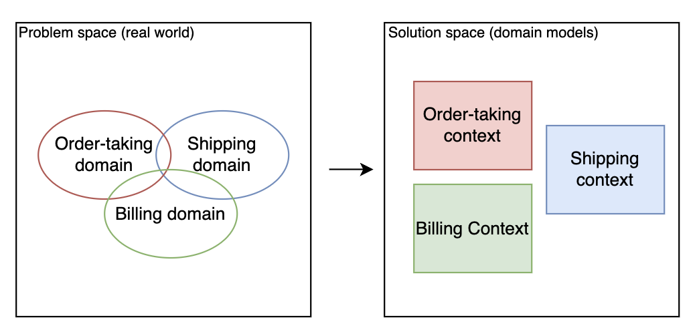
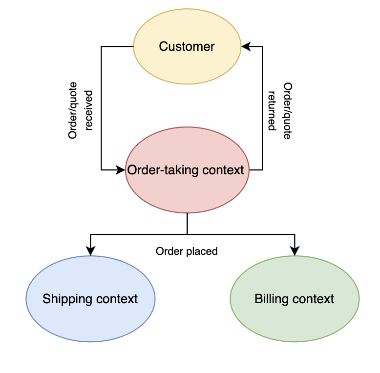
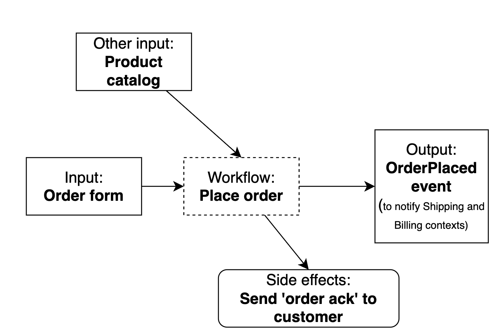
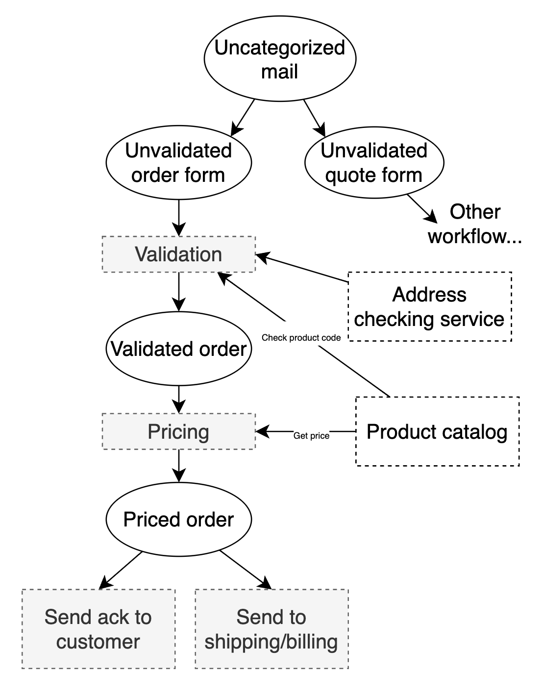
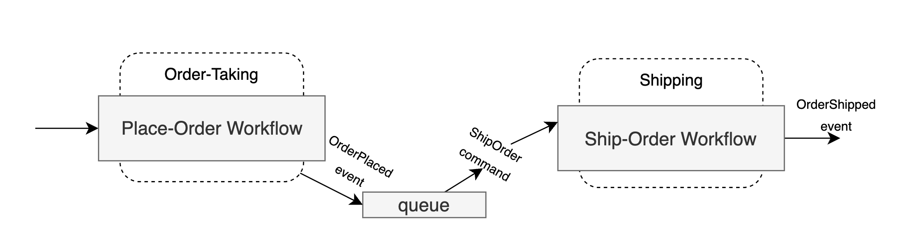
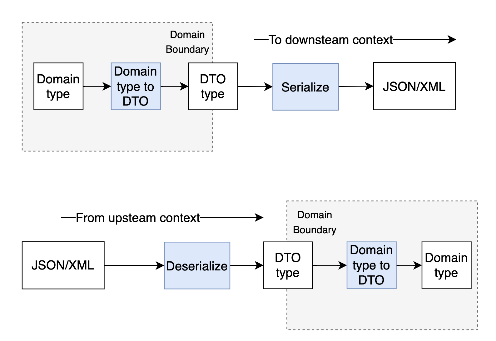
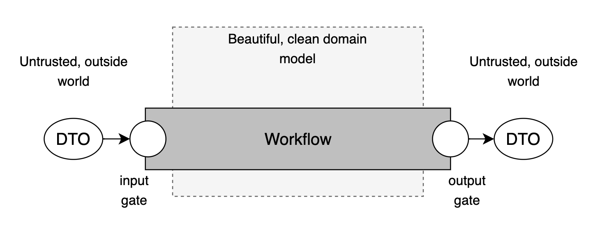
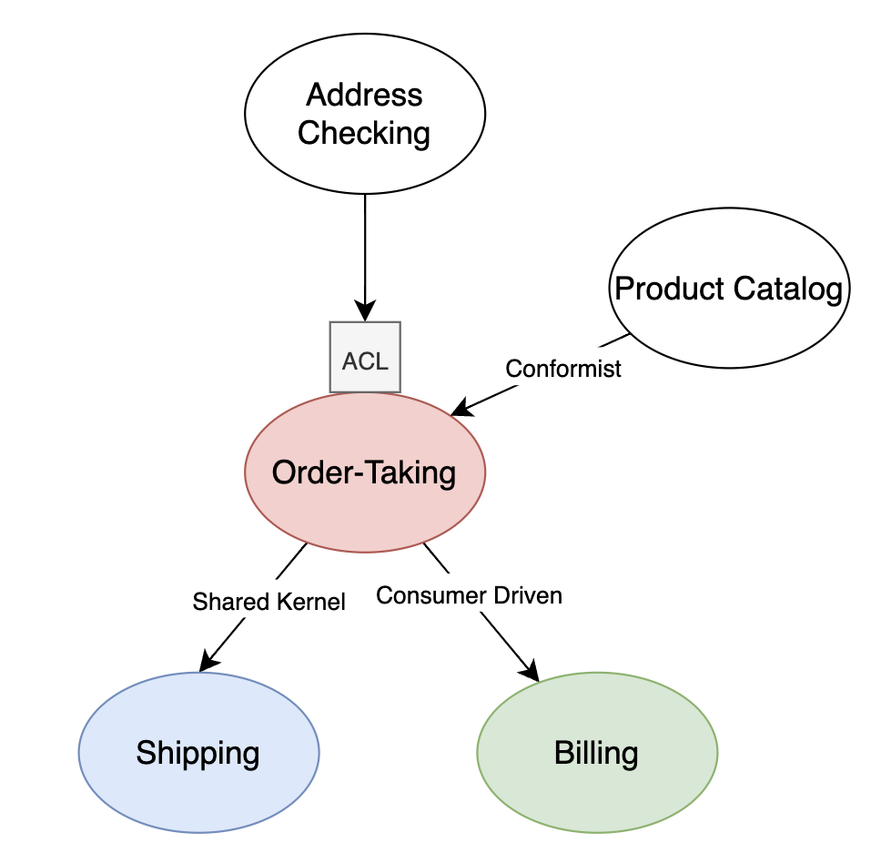

# Understanding the Domain

## Chapter 1 - Introduction to DDD

### The idea

- Development team & domain experts & other stakholders <- all share the same mental model
- No translation is required between requirements (from experts) and code (written by developers)
- Shared mental model

### Guidlines
- Focus on events and processes rather than data
- Partition the problem domain into smaller subdomains
- Create a model for each subdomain in the solution
- Develop an "everywhere language" that can be shared between everyone involved in the project

### Concepts
- _Domain_ - area of knowledge associated with the problem we are trying to solve
    - "domain expert" is expert in
    - part of the problem space
- _Domain Model_ - set of simplifications that represent those aspects of a domain that are relevant to the particular problem
    - part of the solution space
- _Ubiquitous Language_ - set of concepts & vocabulary that is associated with the domain
    - shared by the team memebers & the source code
- _Bounded Context_ - subsystem in the solution space with clear boundaries that distinguish from other subsystems
    - often corresponds to a subdomain in the problem space
    - has its own context + vocabulary, its own dialect of the Ubiquitous Language
- _Context Map_ - a high level diagram showing a collection of bounded contexts and the relationship between them
- _Domain event_ - a record of something that happened in the system
    - often triggers additional activity
    - always written in past tense - "New order form received"
- _Command_ - a request for some process to happen and is triggered by a person or another event
    - if it succeeds: the state of the system changes and one or more domain events are recorded
    - an event triggers a command which initiates some business workflow, the output of the workflow are further events that can trigger other commands

### Approach
- Understanding the domain through business events
    - **Domain events**
    - Capture them through design
- **Event storming** to discover domain events

### Case study

**Order-taking System**
- Order taking process is triggered by receiving an order form in the mail
- Workflows for processing a quote, registering a customer, etc.
- When the order-taking team finishes processing the order, an event is triggered the shipping department to start the shipping process and the billing department to start the billing process
- Design process 
    - Discovered 3 subdomains (problem space)
        - Domain experts in billing, shipping and order-taking
    - Defined 3 bounded contexts



- Context Map


- Core domain?
    - core
    - supporting
    - generic
- Ubiquitous Language
    - "order form"
    - "quote"
    - "order"

### Misc

**Workflow:** detailed description of part of a business process.
- Lists the exact steps an eployee needs to do to accomplish a business goal
- Divide the overall business process into a series of smaller workflows (which are then coordinated im some way)

**Business Process:** describes the goal the business wants to achieve.
- Business centric focus

**Scenario:** a goal that a customer wants to achieve.
- User centric focus
- Use case: more detailed version of a scenario
    - User interactions & steps the user needs to take to achieve the goal
    - How interactions appear from a user POV.

## Chapter 2 - Understanding the Domain 

- Place order workflow
    - Input
    - Output
    - Side effects



In DDD we let the _domain_ to drive the design, not a database schema or a class. 

- Avoid Database-Driven Design
    - Model the domain without respect to any particular storage implementation
    - Users do not care about how the data is persisted
    - Principle: persistence ignorance -> forces you to focus on modeling the domain accurately
    - Destortion of the design in favor of fitting the DB model
    - Requirements are subtly lost in DBDD
- Avoid Class-Driven Design
    - Dependency injection - seperating the DB logic from the business logic
    - Introducing bias into the design 
    - Distortion of the domain
- New information learned captured in a diagram



**Documenting the Domain**

```ts
context: Order-Taking

data WidgetCode = string starting with "W" then 4 digits
data GizmoCode = string starting with "G" then 3 digits
data ProductCode = WidgetCode OR GizmoCode

data OrderQuantity = UnitQuantity OR KilogramQuantity

data UnitQuantity = integer between 1 and 1000
data KilogramQuantity = decimal between 0.05 and 100.00 
```

- Order **lifecycle**
    - Unvalidated -> validated -> priced

```ts
data UnvalidatedOrder =
    UnvalidatedCustomerInfo
    AND UnvalidatedShippingAddress
    AND UnvalidatedBillingAddress
    AND list of UnvalidatedOrderLine

data UnvalidatedOrderLine =
    UnvalidatedProductCode
    AND UnvalidatedOrderQuantity

data ValidatedOrder =
    ValidatedCustomerInfo
    AND ValidatedShippingAddress
    AND ValidatedBillingAddress
    AND list of ValidatedOrderLine

data ValidatedOrderLine =
    ValidatedProductCode
    AND ValidatedOrderQuantity

data PricedOrder =     
    ValidatedCustomerInfo
    AND ValidatedShippingAddress
    AND ValidatedBillingAddress
    AND list of PricedOrderLine // different from ValidatedOrderLine
    AND AmountToBill // new

data PricedOrderLine =
    ValidatedOrderLine
    AND LinePrice

data PlacedOrderAcknowledgement =
    PricedOrder
    AND AcknowledgementLetter
```

**Steps in the Workflow**

```ts
workflow "Place Order" = 
    input: OrderForm
    output: 
        OrderPlaced event (put on a pile to send to other teams)
        OR InvalidOrder (put on appropriate pile)

    // step 1
    if order is invalid then:
        add InvalidOrder to pile
        stop
    
    // step 2
    do PriceOrder

    // step 3
    do SendAcknowledgementToCustomer

    // step 4
    return OrderPlaced event (if no errors)
```

```ts
substep "ValidatedOrder" =
    input: UnvalidatedOrder
    output: ValidatedOrder OR ValidationError
    dependencies: CheckProductCodeExists, CheckAddressExists

    validate the customer name
    check that the shipping and billing address exists
    for each line:
        check product code syntax
        check that product exists in ProductCatalog
    
    if everything OK, then:
        return ValidatedOrder
    else:
        return ValidationError
```

```ts
substep "PriceOrder" =
    input: ValidatedOrder
    output: PricedOrder
    dependencies: GetProductPrice

    for each line:
        get the price for the product
        set the price for the line
    
    set the amount to bill (=sum of the line prices)
```

```ts
substep "SendAcknowledgementToCustomer" =
    input: PricedOrder
    output: None

    create ack letter and send it
    and the priced order to the customer
```

- This documentation looks a lot like code, but can still be checked by the domain experts

## Chapter 3 - A Functional Architecture

C4:
- System Context - top level; represents the entire system
- Containers - system context compromises a number of them; deployable units
- Components - each container compromises a number of them; major structural building blocks in the code
- Classes (modules) - each component compromises them; contain a set of low level methods or functions

Good architecture - define the boundaries between containers, components & modules such that when new requirements arise the cost of change is minimal.

Bounded contexts are autonomous software components with well defined boundaries.

- Single container/monolithic deployable -> bounded context is separate module with a well defined interface
- Service oriented or microservice architecture
- No need to make a decision, only to ensure the bounded contexts stay decoupled and autonomous
- Can start out with monolith with well defined interfaces
- Microservice premium = the extra burden on operations
- Avoid distributed monoliths 
    - switch one of the microservices off and other microservices break

### Communication between Bounded Contexts

- Ensuring decoupled design
    - Use queues & events for example



### Transferring Data between Bounded Contexts
- Domain Object is an object designed to for use only within the boundaries of a context, as opposed to a Data Transfer Object
- Data Transfer Objects (DTO) is an object designed to be serialized and shared between contexts



### Trust Boundaries and Validation

- Perimeter of a bounded context acts as a "trust boundary"
- "Gates" act as intermediaries between trusted domain and untrusted outside world
    - input -> always validate
    - output -> ensure that private information does not leak



### Contracts between Bounded-Contexts

- **Shared Kernel** - the two contexts share some common domain design
    - teams involved must collaborate
    - order-taking and shipping context must use the same design for the delivery address
        - order-taking accepts and validates address
        - shipping context uses the same address to ship the order 
- **Customer/Supplier or Customer Driven Contract** - the downstream context defines the contract that they want the upstream context to provide
    - the two domains can evolve independently as long as the upstream context fulfills its obligations under the contract
    - Billing context might define the contract and the order-taking context provides the information and no more
- **Conformist relationship** - the downstream context accepts the domain provided by the upstream context and adapts its own domain model to match
    - Order-taking model might adapt its model based on what the product catalog provides

**Anti Corruption Layer** (or ACL) is a component that translates concepts from one domain to another in order to reduce coupling and allows domains to evolve independently.

- Input gate - preventing the internal, pure domain from getting corrupted by the knowledge of the outside world
- Translator between two different languages
- Common pattern when using 3rd party components
    - Helps in avoiding vendor lock-in



- Order-taking and Shipping will jointly own the communications contract
- The Billing context determines the contract and the Order-taking system will provide the contract
- Order-taking context will submit to using the same model as the product catalog
- External address checking service has a model that is not at all similar to our domain, hence the ACL