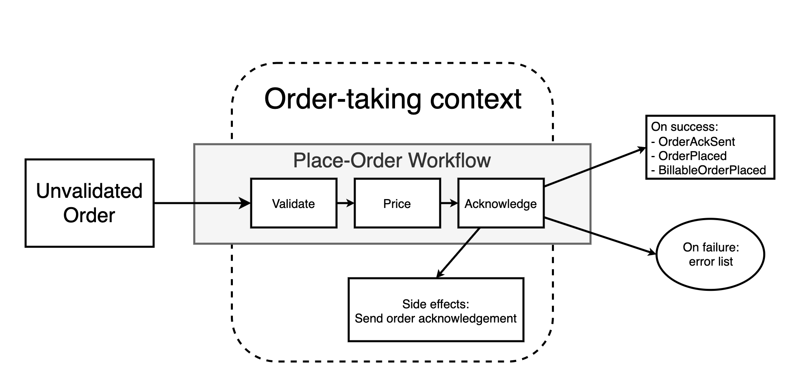
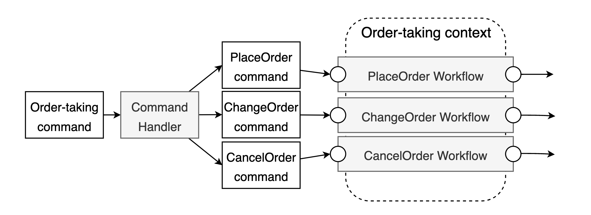
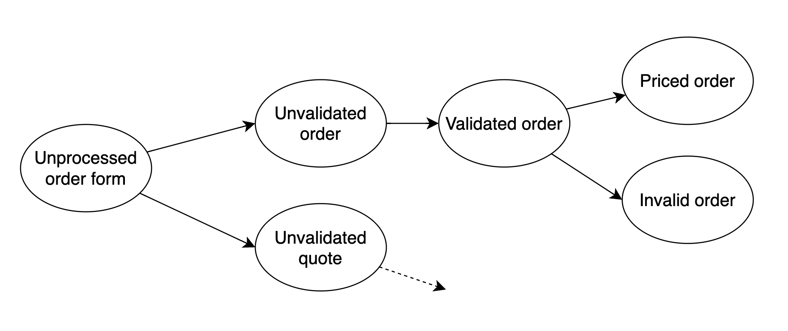
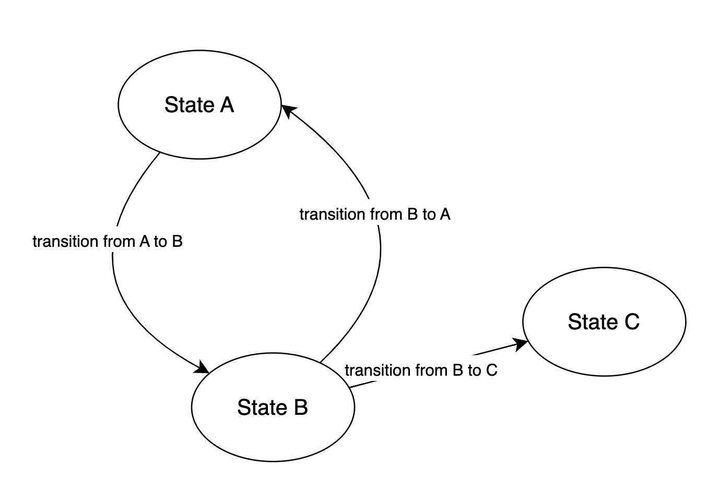
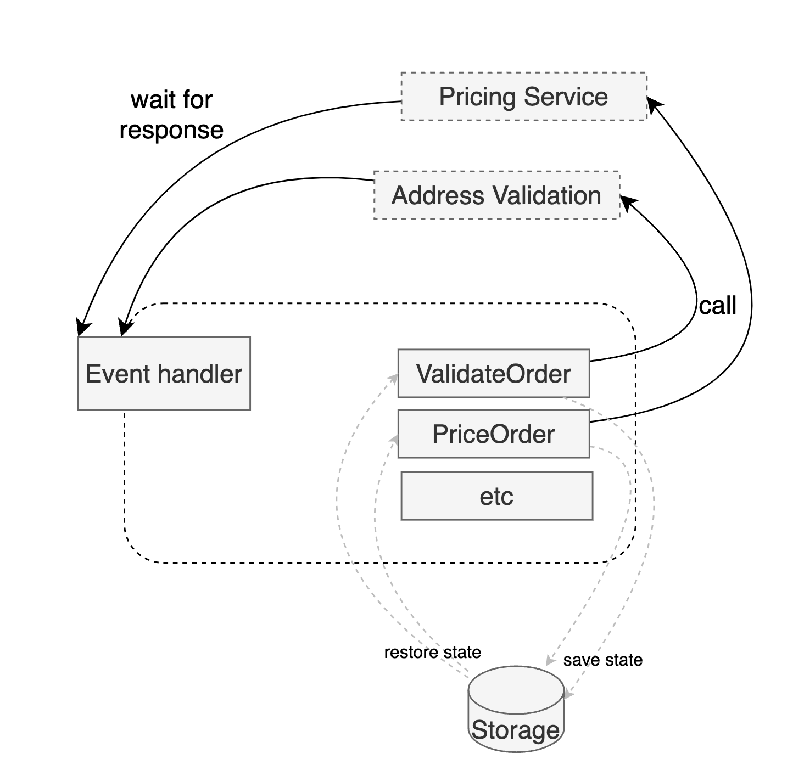

# Modeling the Domain

## Chapter 4 - Understanding Types

- Represent the requirements using F#'s algebraic type system
- Function: apple -> banana
- Type - set of possible values that can be used as inputs or outputs of a function
    - Determines the function's signature

**Jargon:**
- Values
    - Immutable
    - Functional paradigm
- Variables
    - Mutable
- Objects
    - Encapsulation of data structures and it's associated behaviour (methods)
    - Have state (mutable)


### Composition of Types
- Combine 2 things to make a bigger thing
- `AND` - product type, `OR` - sum type/discriminated unions
- Record type
    - Fruit salad = 🍎 `AND` 🍌 `AND` 🍒
```fsharp
type FruitSalad = {
    Apple: AppleVariety;
    Banana: BananaVariety;
    Cherry: CherryVariety;
}
```
- Choice type
    - Fruit snack = 🍎 `OR` 🍌 `OR` 🍒
```fsharp
type FruitSalad = 
    | Apple of AppleVariety
    | Banana of BananaVariety
    | Cherry of CherryVariety
```

Algebraic type system = every compound type is composed from smaller types by `AND`ing or `OR`ing them together

### Modeling Optional Values, Errors, and Collections

- Optional Values: `Option` (`Some`, `None`)
- Errors: `Result` (`Ok`, `Err`)
- No values at all: `unit`

## Chapter 5 - Domain Modeling with Types

### Seeing patterns in the Domain Model
- Can types replace documentation?
- Simple Values
    - Primitive types such as string and integers
    - Wrapper types `OrderId` and `ProductCode` - part of the ubiquitous language
    - Wrappers will be called simple types
        - Creating simple types ensures we cannot confuse `OrderId` with `ProductCode`
        - When comparing them we get a compile error
    - Performance cost (memory & efficiency)
- Combination of Values (`AND`)
- Choice (`OR`)
- Workflows -> verbs of the UL
    - Business processes with inputs and outputs

**Persistent identity**
- Objects with persistent identity are called entities
- Objects without persistent identity are called value objects

### A Question of Identity: Value Objects
- No unique identity, interchangeable
- Immutability is required
- Values without identity
- Simple type example

```fsharp
let widgetCode1 = WidgetCode "W1234"
let widgetCode2 = WidgetCode "W1234"
(widgetCode1 = widgetCode2) // true
```

- Complex type example
    - 2 personal names with the same fields are interchangable
```fsharp
let person1 = {firstName="Alex"; lastName="Bennet"}
let person2 = {firstName="Alex"; lastName="Bennet"}
(person1 = person2) // true
```
Even though person1 and person2 have the same name, they might not be the same person.
### A Question of Identity: Entities
- Unique identity
    - Even if I change my name or address, I am still the same person
- They have a life cycle
    - Transformed from one state to the other by various business processes
- The distinction between Value Objects and Entities are context dependent
    - When phones are manufactured, each phone is given a unique serial number
    - When phones are sold, the serial number is not relevant - all phones with the same specs are interchangeable
    - Particular phone sold to a particular customer, the identity of a phone becomes relevant as well
- Entities need to have stable identities despite changes
    - Unique identifier (`OrderId`, `CustomerId`)
        - Natural (serial number, etc)
        - Artifical (UUID)
- Equality if the identifiers are the same

### Aggregates

- Collection of entities/domain objects/related objects; `Order` and `OrderLine`
    - Can be treated as a single unit
    - Changes to the `OrderLine` (price update to one of them) will create a ripple effect due to immutability and also change the `Order` itself
    - The top-level entity is `Order` - aggregate root
- Enforce consistency and invariants (integrity)
    - When data is updated in one part of the aggregate, other parts might also need updating
    - **Consistency boundary**
- If the line price changes on an order line level, the total price might need to change on an order level
- Invariants are enforced
    - Every order has at least one line item
    - When deleting multiple lines, the aggregate ensures there is an error when only one item is left
- **Aggregate References**
    - Add a `CustomerId` to the `Order` not the whole `Customer` to avoid the ripple effect of updating the `Customer` as well when the order changes
    - `Customer` and `Order` are distinct and independent aggregates
- Atomic unit of persistence, database transactions, and data transfer
    - Serialization - send the whole aggregate not just parts of them

## Chapter 6 - Integrity and Consistency in the Domain

Trusted domain = integrity & consistency

**Integrity** in this context means that a piece of data follows the correct business rules.

- Ensuring the integrity of simple values
    - private constructor
    - creation should happen in a module where constraints are checked
- Units of Measure
    - `1<kg>` = `1<unit>`
- Enforcing Invariants with the Type System
    - Invariant - condition that stays true no matter what else happens
    - Non-empty orderline list
- Capturing Business Rules in the Type System
    - Verified vs Unverified email address
    - Make illegal states unrepresentable

🚫: 

```fsharp
type CustomerEmail = {
    EmailAddress: EmailAddress;
    Verified: bool;
}
```

✅: 
```fsharp
type CustomerEmail = 
    | Unverified of EmailAddress
    | Verified of VerifiedEmailAddress

type SendPasswordResetEmail: VerifiedEmailAddress -> unit
```

A customer must have an email or postal address:

🚫: 

```fsharp
type Contact = {
    Name: string;
    Email: EmailContactInfo option;
    Address: PostalContactInfo option;
}
```

✅: 
```fsharp
type BothContactMethod = {
    Email: EmailContactInfo;
    Address: PostalContactInfo;
}

type ContactInfo = 
    | EmailOnly of EmailContactInfo
    | AddressOnly of PostalContactInfo
    | Both of BothContactMethod

type Contact = {
    Name: string;
    ContactInfo: ContactInfo;
}

```


**Consistency** means that different parts of the domain model agree about facts.
- For example, the total amount to bill of an order should be the sum of the individual line items.
- When an order is placed a corresponding invoice must be created
    - Consistency between different contexts
    - Billing domain (invoicing), order-taking domain (order created)
    - Event driven systems
    - When the event is lost?
        - Do nothing, write off the cost
        - Reconciliation process
        - Compensation action
    - Eventual consistency != optional consistency
- Business term
- If a voucher is used with an order, voucher must be invalidated
- Context dependent
- Atomicity of persistance is related
- Aggregates -> consistency of boundary and a unit of persistance
    - Also unit of atomicity (transactions) -> if order is saved in the DB, we must ensure the lines are also saved on the order
- Consistency between aggregates in the same context
    - Transaction
    - Eventual consistency
    - Refactor the design
        - Don't reuse aggregates if they don't make sense
- Multiple aggregates acting on the same data
    - Constraints can be shared accross multiple aggregates

## Chapter 7 - Modeling Workflows as Pipelines

- Transformation oriented programming


- Each step in the pipeline is designed to be stateless and side effect free
    - Each step can be tested and understood independently
- The input of the workflow should always be a domain object (real input is the command)

```fsharp
// Command
type PlaceOrder = {
    OrderForm: UnvalidatedOrder;
    Timestamp: DateTime;
    UserId: string;
    // etc
}
```

```fsharp
type Command<'data> = {
    Data: 'data;
    Timestamp: DateTime;
    UserId: string;
    // etc
}

// Workflow specific command
type PlaceOrder = Command<UnvalidatedOrder>
```

### Combining Multiple Commands in One Type

- Can happen that all commands for a bounded context will be sent on the same input channel (message queue)
    - Unifying them into one datastructure

```fsharp
type OrderTakingCommand = 
    | Place of PlaceOrder
    | Change of ChangeOrder
    | Cancel of CancelOrder
```

- Choice type mapped to a DTO and serialized
- New routing and dispatching input stage at the edge of the bounded context
    - "Infrastructure" ring of the Onion Architecture



### Modeling an Order as a Set of States
- Order has a lifecycle
    - Transitions through different states



The wrong design of states 🚫: 

```fsharp
type Order = {
    OrderId: OrderId;
    IsValidated: bool; // set when validated
    IsPriced: bool; // set when priced
    AmountToBill: decimal option; // also set when priced
}
```

- States are implicit and would require lots of conditional code in order to be handled
- Some states have data that is not needed in other states
    - `AmountToBill` is only needed in the priced state
        - We have to make the field optional
- It is not clear which fields go with which flags
    -`AmountToBill` is required to be set when `IsPriced` is set
        - The design does not enforce this
        - Leads to comments to know this information

A better way:
- Create a new type for each state of the order
    - Eliminate implicit states and conditional fields

✅: 
```fsharp
type ValidatedOrder = {
    OrderId: OrderId;
    CustomerInfo: CustomerInfo;
    ShippingAddress: Address;
    BillingAddress: Address;
    OrderLines: ValidatedOrderLine list;
}

type PricedOrder = {
    OrderId: OrderId;
    CustomerInfo: CustomerInfo;
    ShippingAddress: Address;
    BillingAddress: Address;
    // diff
    OrderLines: PricedOrderLine list;
    AmountToBill: BillingAmount;
}

// represents the order at any time of its lifecycle
type Order = 
    | Unvalidated of UnvalidatedOrder
    | Validated of ValidatedOrder
    | Priced of PricedOrder
```

- The `Order` type can be persisted to storage or communicated to other contexts
    - Can add a new state, for example `RefundedOrder`
- No `Quote` is present in the `Order` type, that is a completely different workflow
- 🚫 Single type with flags < ✅ Set of separate types (each designed for a specific workflow)

### State Machines

**Definition:** a document of record can be in one or more states, with paths from one state to another ("transitions") triggered by commands of some kind.



Examples:
- Email
    - Unverified email -> Verified email (clicking verification link)
    - Verified email -> Unverified email (changed email address)
- Shopping cart
    - Empty (Remove/Add Item)
    - Active (Add Item)
    - Paid (Pay)

**Why use State Machines**
- Each state can have different allowable behaviour
- All the states are explicitly 
- Design tool that forces one to think about every possibility that could occur
    - What should happen if we try to verify an already verified email address

Implementation Details:
- We dont want to use flags and bundle all states into one object

### Documenting Effects
- Effect -> I/O, Network call etc
- Make it clear from the type signature

```fsharp
type AsyncResult<'success, 'failure> = Async<Result<'success, 'failure>> 
```
- Effects in the Validation Step
    - `CheckAddress` is a dependency
```fsharp
type CheckAddress = UnvalidatedAddress -> AsyncResult<CheckedAddress, AddressValidationError> 
```

Composing the workflow? Different inputs and outputs 🤔

### Are Dependencies part of the Design?

Guidlines:
- For functions exposed in a public API, hide dependency information from callers
- For functions used internally, be explicit about their dependencies

### Long Running Workflows
- When workflow takes days to finish, state needs to be persisted and updated
- Before each step the order is loaded from storage


- Sagas